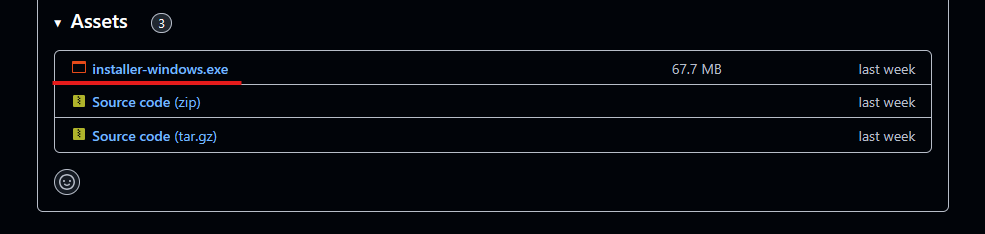
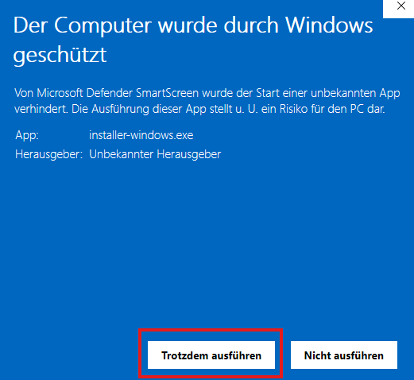
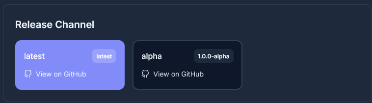
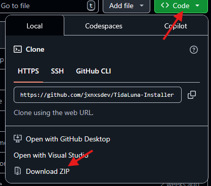
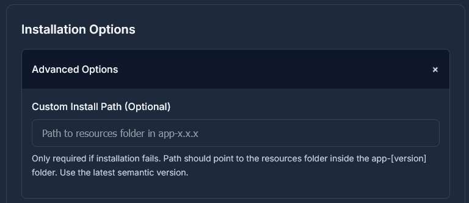
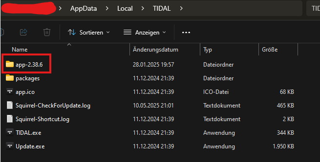
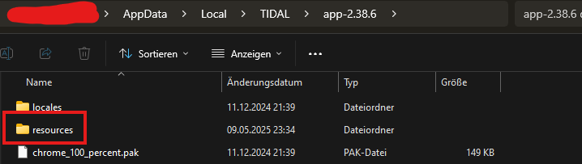

# TidaLuna Installer

Installer for the [TidaLuna](https://github.com/Inrixia/TidaLuna) Tidal Mod.

---

## 🚀 How to Use

The installer should™ work on both **Windows** and **macOS**.  
Currently, **precompiled binaries are available for Windows only**.

---

### 🪟 Windows

#### 🔧 Installing

1. Download the precompiled binary from the [Releases page](https://github.com/jxnxsdev/TidaLuna-Installer/releases).  
   

2. Run the downloaded `installer-windows.exe`.  
   You might encounter a Windows SmartScreen warning. Click **"More info"** and then **"Run anyway"**.  
   A browser window should open automatically. If it doesn't, open `http://localhost:3013` manually.  
     
   

3. **Close Tidal** before continuing.

4. Select a **release channel**. These include `Stable`, `Pre-release`, and `Dev` versions.  
   

5. (Optional) Click on **Advanced Options** if you need to configure installation paths or debug issues.  
   More on that in the [Advanced Options](#advanced-options) section.

6. Click **Install** or **Reinstall** to begin the installation.  
   

---

#### ❌ Uninstalling

1. Download the precompiled binary from the [Releases page](https://github.com/jxnxsdev/TidaLuna-Installer/releases).  
   

2. Run the downloaded `installer-windows.exe`.  
     
   

3. **Close Tidal**

4. Click the **Uninstall** button at the bottom of the page.  
   

---

### 🍏 macOS

> ⚠️ The installer is **untested on macOS**. It should theoretically work, but has not been verified.  
> If you're on macOS and willing to test, feel free to contribute!

#### 📦 Requirements

- Node.js v20
- npm (usually bundled with Node.js)
- This project cloned or downloaded

---

#### 📁 Downloading the Project

1. Scroll to the top of the [repository page](https://github.com/jxnxsdev/TidaLuna-Installer)
2. Click the green **Code** button
3. Select **"Download ZIP"**  
   

---

#### 📥 Installing Dependencies

1. Open a terminal inside the base project folder
2. Run:

   ```bash
   npm install
   ```

---

#### ▶️ Running the App

1. Build the TypeScript code:

   ```bash
   npm run tsc
   ```

2. Start the app:

   ```bash
   node ./build/index.js
   ```

> After this point, the usage is the same as on Windows.

---

## ⚙️ Advanced Options

If the installer cannot locate your Tidal installation, you can manually specify the path.

1. Locate your **Tidal install directory**
2. Navigate into the `app-*` folder (e.g., `app-5.12.0`)
3. Copy the path to the **`resources`** folder inside it  
     
     
   

If you’re unfamiliar with versioning formats, check out [semver.org](https://semver.org/) for a quick guide.

---

## 📎 License

MIT — see [LICENSE](./LICENSE) file for details.
